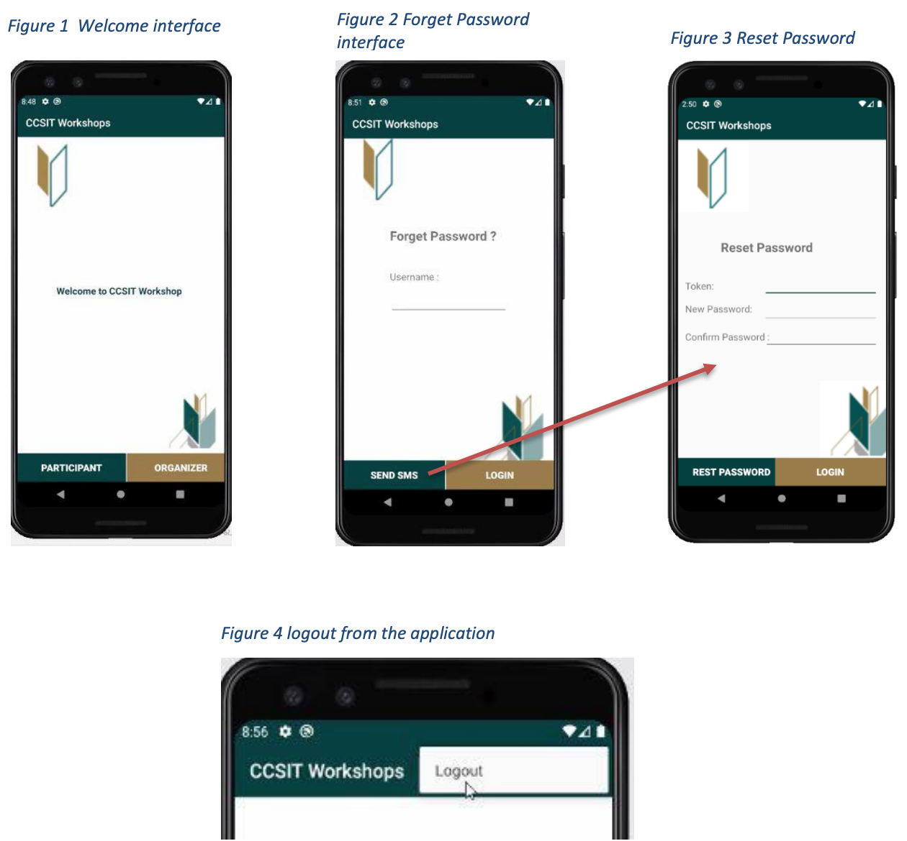
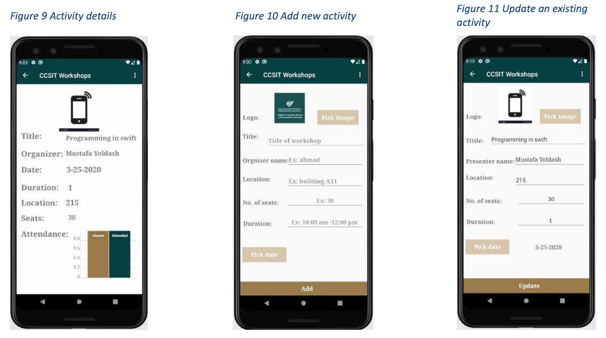
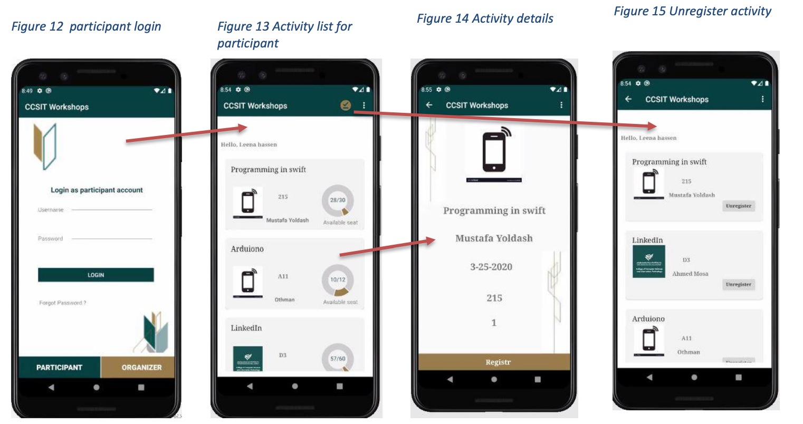

# WorkshopCCSIT

## Motivation
The CCSIT college is aiming to expand student knowledge and experience by making activities such as events with interesting topics or visiting interesting places. To help our college in managing the process of advertising activity, students enrollment, attendance, offer certification and view the statistics in visual form of each event. 

## Aim
We aim to provide a system to manage all these processes.The idea of CCSIT Workshop Management System is to provide a system where the organizer of a workshop will be able to:
- Add, delete, and update workshops easily.
- Generate certificate effortlessly.
- Taking attendance for the workshops.

Also, provide the participant with mechanism to be able to:
- Enroll and unenroll themselves in workshops.
- View their certificate of attendance.

## Screenshots
### General Interfaces
The welcome interface in figure 1 allows the user to select which type of user she/he is to login to the system (e.g., figure 5). The forget password interface in figure 2 allows the user to enter her/his username to receive a token through SMS message based on the number registered in the database when he/she clicks on the “send SMS” button. 
The user will be forwarded to the reset password interface in figure 3, where the token will authenticate the user, and the user will be able to enter the new password.

### Organizer Interfaces
The organizer will be able to login in (figure 5) by clicking on the organizer button to show the login fragment for the organizer. The activity list in (figure 6) appears the list of existing Activity. 
Also, available seats of each activity will be shown in each activity card in the form of a donut chart. The “+” button on the top of the interface allows the organizer to move to the manage activities interface by click on it. 
Manage activities interface in (figure 7) allow the organizer to delete the activity, add new activity (figure 10), and update an existing activity (figure 11). 
Attendance interface in (figure 8) allows the organizer to take attendance for a particular activity.
When the organizer clicks on any activity card in the activity list interface (figure 6), activity details in (figure 9) will appear. Activity details (figure 9) contain information about an activity such as the activity title, organizer name, date, duration, location, number of seats, and attendance in the form of a bar chart. 
From (figure 7), the organizer will be able to access the two following interfaces:
- Add a new activity interface (figure 10) where allow the organizer to add new activity based on the fields shown in the figure.
- Update an existing activity interface (figure 11) will retrieve the information of the activity selected by the organizer to be updated. The organizer would update the desired field and click the update button.

### Participant Interfaces
When the participant login (figure 12) to her/his account, the Activity list (figure 13) will appear. The participant can see the available seats in each activity in the form of a donut chart. When the user clicks on a card, the activity details interface (figure 14) will appear, and the participant will be able to register in that activity. If the participant would like to unregister from an activity, from ✓ button in figure 13, the participant can see the registered activity and unregister from any activity (figure 15).

## Code Example

## IDE
Android Studio 
